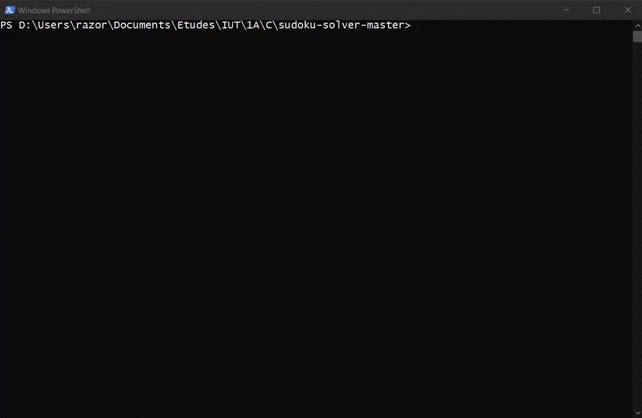
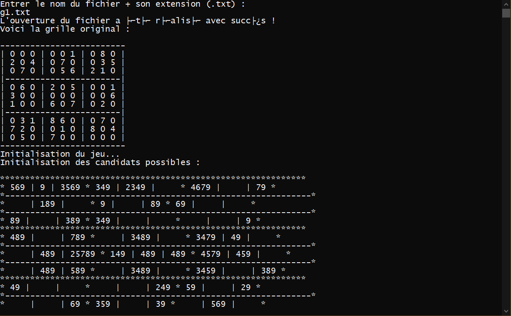
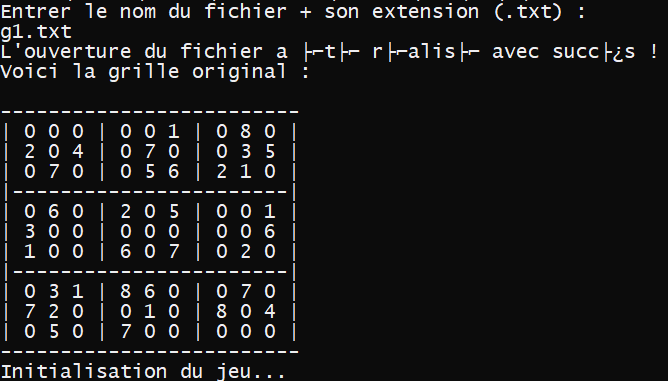
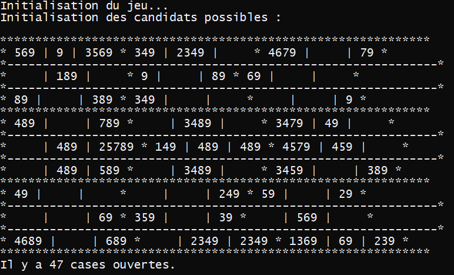
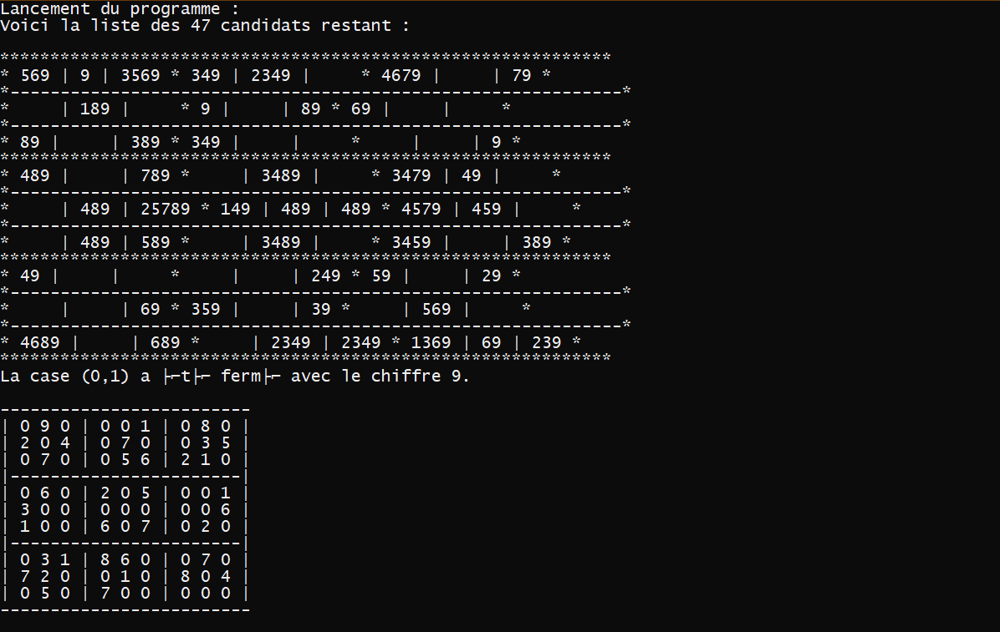
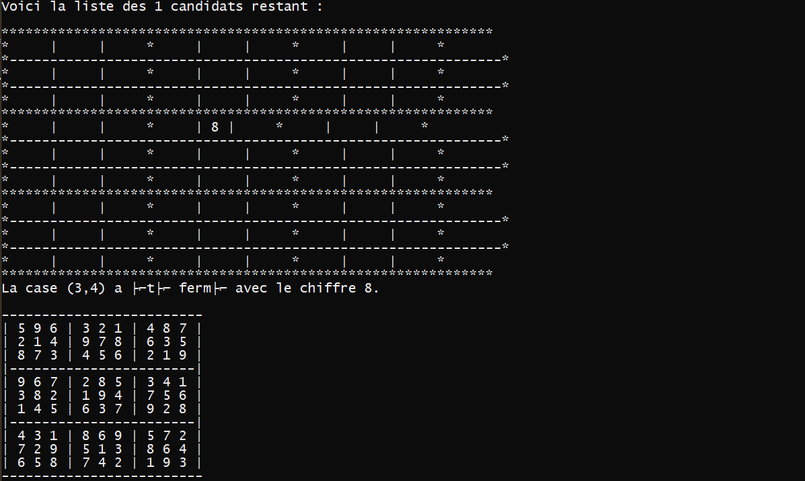

# Sudoku Solver

A simple sudoku solver in command line.

## Features

* Read a grid from a txt file and solve the sudoku.

## Known issues

* The program works almost well, but there's still a small bug that doesn't solve sudoku correctly (depending of the grid). I'll try to fix it one day.

## Language used

C

## Authors

* Adrien (Me)
* Arthur (https://github.com/Arthur57255)

# Screenshots

